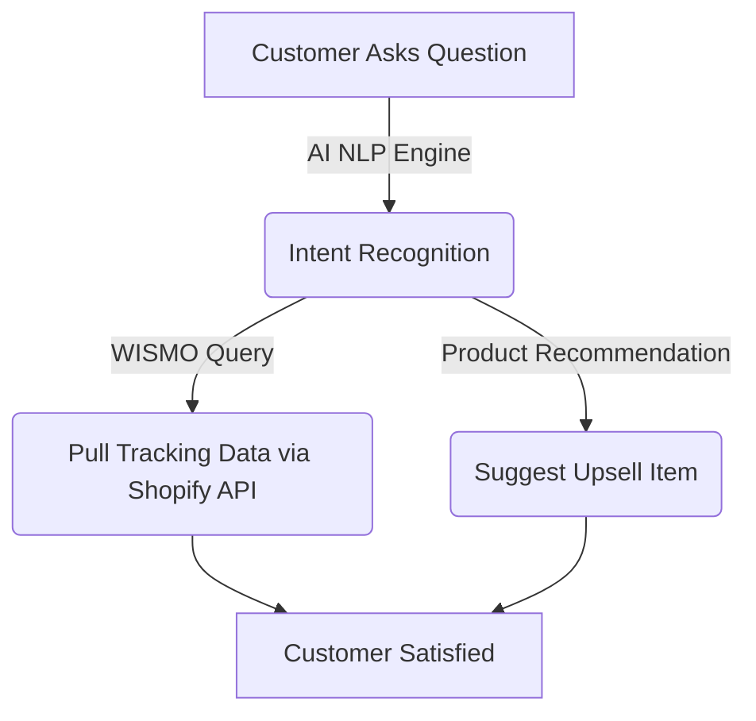

# Top AI Customer Service Chatbots for Your Shopify Store

In e-commerce, customer support is directly tied to revenue. When a user is confused about a return policy or a shipping date, the delay in response usually results in an abandoned cart. The **top AI customer service chatbots for your Shopify store** resolve this by offering instant, accurate, 24/7 support.

Let’s review the best bots designed to integrate flawlessly into the Shopify ecosystem.

## Table of Contents
- [The Impact on Conversion Rates](#the-impact-on-conversion-rates)
- [How E-commerce AI Bots Work](#how-e-commerce-ai-bots-work)
- [Best Chatbots for Shopify](#best-chatbots-for-shopify)
- [Feature Comparison](#feature-comparison)
- [Conclusion](#conclusion)

---

## The Impact on Conversion Rates

When online shoppers know their questions can be answered instantly, trust increases. The top AI customer service chatbots for your Shopify store act as virtual sales assistants that guide users through checkout rather than just "deflecting" them.

## How E-commerce AI Bots Work

The latest bots ingest your Shopify store's entire data catalog, return policies, and previous support tickets. They don't just use set branching paths; they use Generative AI to speak to customers conversationally while pulling live data from their specific order number.

## Best Chatbots for Shopify

### 1. Gorgias
Gorgias is arguably the undisputed king of e-commerce support. Its AI automatically categorizes and prioritizes tickets from all channels (email, Insta, WhatsApp) while deeply integrating with Shopify tracking data.

### 2. Tidio
Tidio offers one of the best AI customer service chatbots for your Shopify store if you are a small to mid-sized business. It has specialized "Lyro AI" that learns your FAQs instantly and provides highly polished conversational responses.

### 3. Zendesk AI
For massive enterprise stores, Zendesk’s new AI features handle immense volume, leveraging historical ticket data to train custom models specific to your products.

## Feature Comparison

When picking the top AI customer service chatbots for your Shopify store, consider this breakdown:

| Chatbot Name | Shopify Integration Depth | Core Feature | Best For | Pricing |
| :--- | :--- | :--- | :--- | :--- |
| **Gorgias** | Deep (Native) | Omni-channel consolidation | D2C Brands | Premium |
| **Tidio** | High | Lyro Generative AI | Small/Mid SMBs | Freemium |
| **Zendesk** | High | Advanced routing | Enterprise | Premium |
| **Chatra** | Medium | Live Chat Focus | Startups | Freemium |

## Conclusion

Abandoning customers on the checkout page is throwing away money. The top AI customer service chatbots for your Shopify store ensure that every visitor receives VIP treatment, drastically improving your retention and conversion rates.
