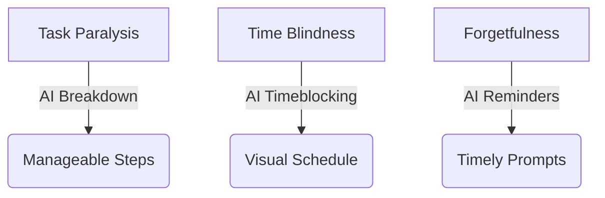

# 7 Essential AI Productivity Tools for Managing ADHD

Managing Attention-Deficit/Hyperactivity Disorder (ADHD) in a world full of distractions is a monumental challenge. Traditional planners often fall short. However, the rise of **AI productivity tools for ADHD** is providing innovative solutions to help individuals organize, focus, and thrive.

These intelligent systems act like a digital executive assistant designed just for your brain.

## Table of Contents
- [How AI Helps with ADHD Executive Function](#how-ai-helps-with-adhd-executive-function)
- [Best Tools for Task Management](#best-tools-for-task-management)
- [Best Tools for Focus & Time Blindness](#best-tools-for-focus--time-blindness)
- [Feature Comparison Matrix](#feature-comparison-matrix)
- [Conclusion](#conclusion)

---

## How AI Helps with ADHD Executive Function

AI productivity tools for ADHD are uniquely suited to address common struggles like *time blindness*, *task paralysis*, and *forgetfulness*. They intervene by auto-scheduling, breaking down massive projects into steps, and sending gentle reminders.

## Best Tools for Task Management

### 1. Motion
Motion is a powerful AI calendar that automatically rearranges your schedule if you miss a task, which is perfect for days when ADHD paralysis hits.

### 2. Goblin.tools
Goblin Tools features a "Magic ToDo" that uses AI to break down overwhelming tasks (like "clean the house") into simple, distinct steps.

## Best Tools for Focus & Time Blindness

### 3. Focusmate
While partly human-powered, its algorithms pair you with an accountability partner around the globe for 50-minute work sessions—a great body-doubling strategy.

### 4. Rewind AI
For the classic "what was I just looking at?" moment, Rewind passively records your screen so you never lose your train of thought.

## Feature Comparison Matrix

When choosing among AI productivity tools for ADHD, consider this breakdown:

| Tool Name | Core Functionality | Anti-ADHD Feature | Pricing |
| :--- | :--- | :--- | :--- |
| **Motion** | AI Calendar/Planner | Auto-rescheduling | Premium |
| **Goblin.tools** | Task Breakdown | "Magic ToDo" steps | Free/One-time App |
| **Focusmate** | Body Doubling | Scheduled accountability | Freemium |
| **Rewind AI** | Digital Memory | Screen recording search | Premium |

## Conclusion

Finding the right AI productivity tools for ADHD can turn overwhelming days into manageable ones. By outsourcing your executive function to AI, you free up your mental energy for creativity and problem-solving.
