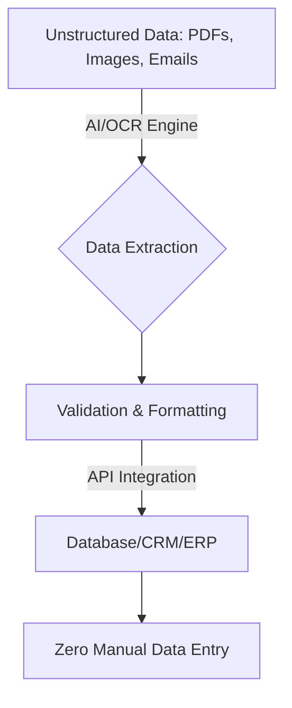

# Ultimate Guide to AI Tools for Automating Data Entry Tasks

Data entry is notoriously tedious, time-consuming, and prone to human error. In 2026, there is absolutely no reason for businesses to rely on manual typing. The sophisticated **AI tools for automating data entry tasks** leverage Optical Character Recognition (OCR) and machine learning to digitize workflows instantly.

Here is your comprehensive guide to the platforms leading the automation revolution.

## Table of Contents
- [How AI is Changing Data Processing](#how-ai-is-changing-data-processing)
- [Best Tools for Invoice Processing](#best-tools-for-invoice-processing)
- [Best Tools for CRM Automation](#best-tools-for-crm-automation)
- [Comparing Automation Software](#comparing-automation-software)
- [Conclusion](#conclusion)

---

## How AI is Changing Data Processing

AI tools for automating data entry tasks do more than just "read" text; they understand context. They know the difference between a total amount on an invoice and a phone number, structuring unstructured data seamlessly.

## Best Tools for Invoice Processing

### 1. Docparser
Docparser excels at extracting data from PDFs and Word documents using smart layout rules and AI pattern recognition. 

### 2. Rossum
Rossum uses cognitive data capture. It “reads” documents the way a human would, meaning it requires zero templating for different supplier invoice layouts.

## Best Tools for CRM Automation

### 3. Magical
Magical is a brilliant AI tools for automating data entry tasks specifically for sales teams. It instantly moves data from LinkedIn directly into Salesforce or HubSpot with zero coding required.

### 4. Zapier AI
Zapier connects thousands of apps. With its new AI features, you can prompt it to parse incoming emails and automatically fill out spreadsheet rows.

## Comparing Automation Software

Choose the best platform for your office:

| Tool | Core Strength | Technical Setup Required | Best For |
| :--- | :--- | :--- | :--- |
| **Rossum** | Invoice processing | Medium | Finance Departments |
| **Docparser** | PDF data extraction | Medium | Logistics, HR |
| **Magical** | CRM data transfer | Low (Chrome Ext.) | Sales, Recruiters |
| **Zapier AI** | Cross-app workflows | Low-Medium | Operations, Marketing |

## Conclusion

Implementing AI tools for automating data entry tasks is one of the fastest ways to see an immediate ROI. It eliminates errors and frees up your staff to perform high-level analytical work.
