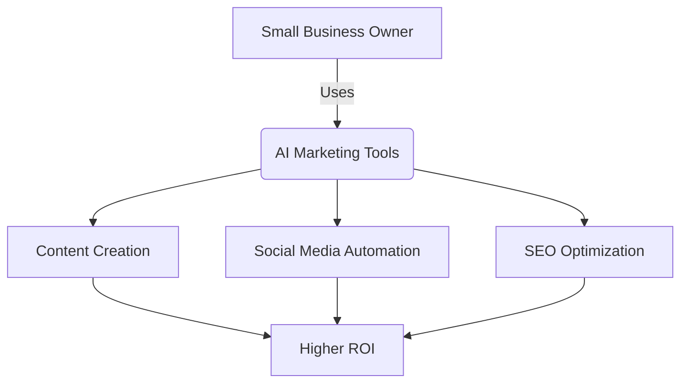

# The 10 Best AI Tools for Small Business Marketing in 2026

Are you tired of spending hours on repetitive marketing tasks? Small business owners wear multiple hats, but thanks to artificial intelligence, you can automate your workflow and focus on what truly matters: growing your business. 

In this ultimate guide, we will explore the **best AI tools for small business marketing** to supercharge your content creation, social media management, and data analytics.

## Table of Contents
- [Why Small Businesses Need AI Tools](#why-small-businesses-need-ai-tools)
- [Top AI Tools for Content Creation](#top-ai-tools-for-content-creation)
- [Top AI Tools for Social Media & SEO](#top-ai-tools-for-social-media--seo)
- [Comparison: Which Tool is Right for You?](#comparison-which-tool-is-right-for-you)
- [Conclusion](#conclusion)

---

## Why Small Businesses Need AI Tools

Adopting the best AI tools for small business marketing allows you to punch above your weight class. AI can:
*   Generate high-quality blog posts in seconds.
*   Analyze customer data to predict trends.
*   Automate social media scheduling for optimal engagement.

## Top AI Tools for Content Creation

Creating compelling content consistently is a struggle. Here are the leading platforms:

### 1. Jasper AI: Top Writing Assistant
Jasper remains one of the best AI tools for small business marketing when it comes to long-form content. It excels at maintaining brand voice.

### 2. Copy.ai: Best for Quick Copy
If you need fast ad copy, product descriptions, or emails, Copy.ai is your go-to AI productivity tool.

## Top AI Tools for Social Media & SEO

### 3. Hootsuite Amplify
Hootsuite's integrated AI helps generate captions and schedule posts at peak times.

### 4. SurferSEO
For organic growth, SurferSEO analyzes top-ranking pages and provides a roadmap for your content.

## Comparison: Which Tool is Right for You?

Here is a quick breakdown to help you choose the best AI tools for small business marketing:

| Tool Name | Best Feature | Pricing Tier | Ideal For |
| :--- | :--- | :--- | :--- |
| **Jasper AI** | Brand Voice Recognition | Premium | Bloggers, Content Teams |
| **Copy.ai** | Pre-built Templates | Freemium | Ad Agencies, E-commerce |
| **SurferSEO** | Keyword Density Analysis | Premium | SEO Specialists |
| **Canva (Magic Studio)** | Instant Graphic Generation | Freemium | Visual Marketers |

## Conclusion

Integrating the best AI tools for small business marketing effectively gives you a dedicated marketing team at a fraction of the cost. Start exploring these platforms today and watch your business thrive!
