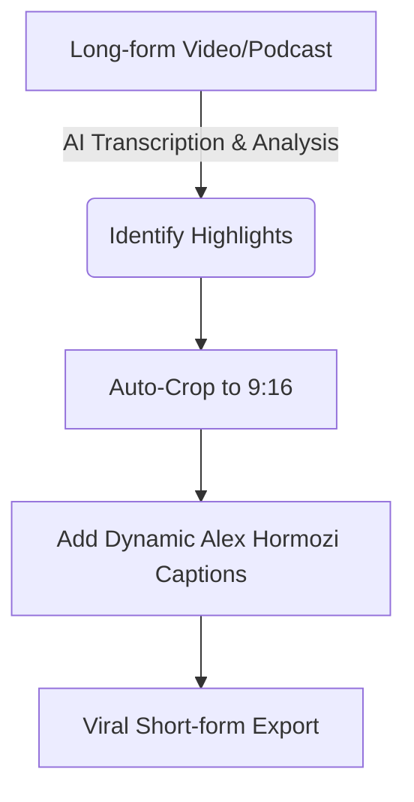

# Best AI Video Editing Software for Viral YouTube Shorts

Short-form content dominates the internet. To win on platforms like YouTube, TikTok, and Instagram, creators must post high-quality vertical videos consistently. The secret to this extreme output is utilizing the **best AI video editing software for viral YouTube Shorts**.

These tools can take a one-hour podcast and automatically clip it into 10 highly engaging vertical videos.

## Table of Contents
- [Why AI is Mandatory for Shorts](#why-ai-is-mandatory-for-shorts)
- [Top AI Tools for Clipping Long-Form to Short-Form](#top-ai-tools-for-clipping-long-form-to-short-form)
- [Top Tools for Dynamic Captions](#top-tools-for-dynamic-captions)
- [Comparison Specs](#comparison-specs)
- [Conclusion](#conclusion)

---

## Why AI is Mandatory for Shorts

Attention spans are shorter than ever. Viral videos require fast-paced edits, dynamic captions, and sound effects. Doing this manually takes hours per minute of video. AI handles the heavy lifting by identifying the most engaging hooks in your raw footage.

## Top AI Tools for Clipping Long-Form to Short-Form

### 1. Opus Clip
Opus Clip is arguably the best AI video editing software for viral YouTube Shorts. It analyzes your long video, scores clips based on "virality potential," and auto-generates captions with emojis.

### 2. Munch
Munch not only edits the video but pulls trending data from TikTok and YouTube to ensure the clips it creates align with what audiences are currently searching for.

## Top Tools for Dynamic Captions

### 3. Submagic
If you already have a 60-second clip and just need world-class, dynamic captions, B-roll insertions, and sound effects, Submagic does this flawlessly in seconds.

### 4. Veed.io
Veed provides a powerful, web-based timeline editor alongside AI text-to-speech, auto-subtitles, and magic background noise removal.

## Comparison Specs

Review the best AI video editing software for viral YouTube Shorts below:

| AI Toolkit | Primary Function | Standout Feature | Virality Score? |
| :--- | :--- | :--- | :--- |
| **Opus Clip** | Long-to-Short Conversion | Auto face-tracking | Yes |
| **Munch** | Content Repurposing | Trend analysis matching | Yes |
| **Submagic** | Captions & Polish | Auto B-Roll insertion | No |
| **Veed.io** | Web-based Editing | Eye-contact correction | No |

## Conclusion

To capture the algorithm, you need consistency and quality. The best AI video editing software for viral YouTube Shorts acts as a 24/7 video editor, allowing you to flood the timeline with engaging content effortlessly.
