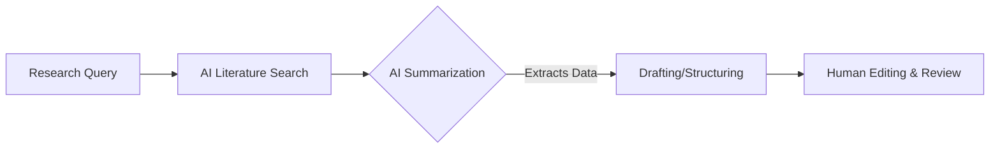

# The Best AI Writing Assistants for Academic Papers and Research

Academic writing is a rigorous process involving endless literature reviews, strict formatting, and complex data synthesis. To maintain high standards while increasing efficiency, scholars are turning to the **best AI writing assistants for academic papers**.

Let's explore the tools that are built specifically to handle the demands of academic research without compromising on academic integrity.

## Table of Contents
- [The Role of AI in Academia](#the-role-of-ai-in-academia)
- [Top AI for Literature Reviews](#top-ai-for-literature-reviews)
- [Top AI for Drafting and Citations](#top-ai-for-drafting-and-citations)
- [Tool Comparison for Researchers](#tool-comparison-for-researchers)
- [Final Review](#final-review)

---

## The Role of AI in Academia

It's critical to distinguish between using AI to *write* an essay (which is plagiarism) and using the best AI writing assistants for academic papers as *research tools*. These platforms help researchers map concepts, quickly digest PDFs, and correctly format citations.

## Top AI for Literature Reviews

### 1. Consensus
Consensus is a search engine that uses AI to find answers directly from peer-reviewed scientific papers, providing evidence-backed conclusions instantly.

### 2. Elicit
Elicit acts as an AI research assistant. You ask it a question, and it finds relevant papers, summarizes them, and extracts key data (like methodology or sample size) into a neat table.

## Top AI for Drafting and Citations

### 3. Jenni AI
Jenni AI is highly regarded as one of the best AI writing assistants for academic papers because of its built-in in-text citation generator that pulls directly from real, published sources.

### 4. QuillBot
QuillBot is excellent for paraphrasing complex jargon into clear, readable academic prose, helping non-native speakers refine their manuscripts.

## Tool Comparison for Researchers

Find the right tool for your thesis or dissertation:

| AI Tool | Primary Academic Use | Unique Feature | Requires Subscription |
| :--- | :--- | :--- | :--- |
| **Consensus** | Literature Search | "Yes/No" consensus meter | Freemium |
| **Elicit** | Paper Summarization | Extracts data tables from PDFs | Freemium |
| **Jenni AI** | Co-writing/Drafting | Real-time citation formatting | Yes (Premium) |
| **QuillBot** | Editing/Refining | Academic tone formatting | Freemium |

## Final Review

Embracing the best AI writing assistants for academic papers allows researchers to spend less time formatting bibliographies and more time analyzing their actual data. Always remember to use these tools ethically and verify all citations!
