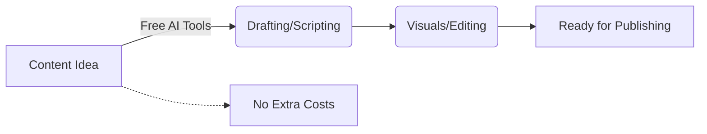

# Top Free AI Tools for Content Creators: Boost Your Workflow

In the digital age, content is king, but producing it consistently can be overwhelming. Fortunately, you don't need a massive budget to access cutting-edge technology. The **free AI tools for content creators** are revolutionizing the way we write, design, and edit.

Whether you are a YouTuber, blogger, or social media influencer, these tools will enhance your productivity.

## Table of Contents
- [The Rise of Free Content Creation AI](#the-rise-of-free-content-creation-ai)
- [Free AI Writing & Ideation](#free-ai-writing--ideation)
- [Free Visuals & Video Editing](#free-visuals--video-editing)
- [Comparison: Best Free Tools](#comparison-best-free-tools)
- [Final Thoughts](#final-thoughts)

---

## The Rise of Free Content Creation AI

Using free AI tools for content creators allows you to scale your production up quickly. By automating mundane tasks like drafting outlines, removing backgrounds, or generating captions, you get to focus purely on the creative aspect of your work.

## Free AI Writing & Ideation

### 1. ChatGPT (Free Version)
ChatGPT remains an indispensable tool for brainstorming scripts, outlining articles, and generating engaging social media posts.

### 2. Claude AI (Sonnet)
Claude offers a generous free tier that excels in nuance and tone, making it perfect for long-form narrative content.

## Free Visuals & Video Editing

### 3. CapCut Desktop
While often known for its mobile app, the desktop version is packed with free AI tools for content creators like auto-captions and background removal.

### 4. Microsoft Designer
This tool uses DALL-E 3 technology for free, allowing you to generate stunning thumbnails and social media graphics.

## Comparison: Best Free Tools

Here is a side-by-side comparison of the best free AI tools for content creators:

| Tool Category | Top Recommendation | Best For | Core Feature |
| :--- | :--- | :--- | :--- |
| **Writing/Ideation** | ChatGPT | Script outlines, Idea generation | Conversational interface |
| **Video Editing** | CapCut | YouTube Shorts, TikToks | Auto-captions & templates |
| **Graphic Design** | MS Designer | Thumbnails, Social posts | Free image generation |
| **Audio Enhancement** | Adobe Podcast | Voiceovers, Podcasts | Background noise removal |

## Final Thoughts

Leveraging free AI tools for content creators is the secret weapon for growing an audience in 2026. Start incorporating these into your daily routine and watch your workflow soar.
