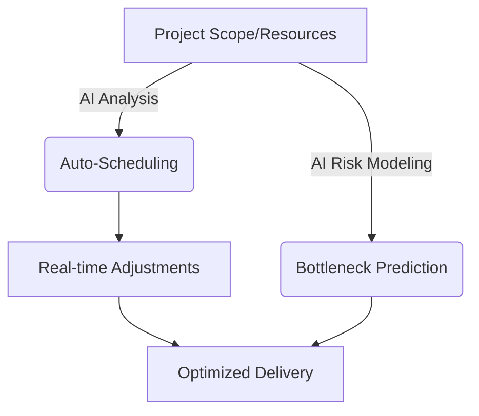

# How to Use AI for Project Management: Best Tools to Try

Project management defines the fine line between business success and chaotic failure. As projects grow in complexity, relying on spreadsheets is no longer enough. Understanding **how to use AI for project management** is crucial for teams looking to boost efficiency and predict roadblocks before they happen.

Let’s dive into how AI is revolutionizing team coordination and the best tools available in 2026.

## Table of Contents
- [The Shift Towards Intelligent PM Tools](#the-shift-towards-intelligent-pm-tools)
- [Key Benefits of AI Project Management](#key-benefits-of-ai-project-management)
- [Best PM Platforms with Native AI](#best-pm-platforms-with-native-ai)
- [AI Tool Comparison Table](#ai-tool-comparison-table)
- [Conclusion](#conclusion)

---

## The Shift Towards Intelligent PM Tools

Traditional project management tools act as digital filing cabinets. AI-powered tools function as an active participant—a co-project manager. Learning how to use AI for project management involves letting algorithms handle scheduling conflicts, resource allocation, and risk assessment automatically.

## Key Benefits of AI Project Management

- **Predictive Analytics:** AI can analyze historical data to accurately predict how long a specific task will take your team.
- **Smart Resource Allocation:** AI prevents burnout by identifying when an employee is over-assigned.
- **Automated Status Reports:** Natural Language Processing (NLP) tools summarize meeting notes and generate daily updates instantly.

## Best PM Platforms with Native AI

### 1. Asana Intelligence
Asana's AI can automatically write task descriptions, summarize long comment threads, and adapt workflows dynamically based on team capacity.

### 2. Monday.com (Monday AI)
Monday has built an AI assistant that builds entire project boards from a simple text prompt, streamlining the project initiation phase.

### 3. ClickUp Brain
ClickUp features one of the most robust integrations, allowing you to ask questions about your company's wiki or auto-fill subtasks for any project.

## AI Tool Comparison Table

Compare the leading tools for understanding how to use AI for project management:

| Tool Name | Standout AI Feature | Best For | Learning Curve |
| :--- | :--- | :--- | :--- |
| **Asana** | Thread summarization | Enterprise teams | Low |
| **Monday.com** | Automated board creation | Visual workflows | Medium |
| **ClickUp** | Enterprise search (Brain) | All-in-one workspaces | Steep |
| **Notion AI** | Intelligent documentation | Creative agencies | Low |

## Conclusion

Mastering how to use AI for project management isn't just about adopting new software; it's a paradigm shift. Start integrating these intelligent features today and transform the way your team collaborates.
